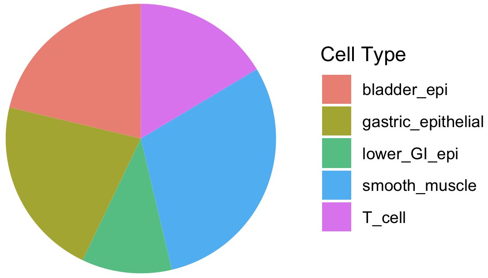

`CytoMethIC` is a comprehensive package that provides model data and functions
for easily using machine learning models that use data from the DNA methylome
to classify cancer type and phenotype from a sample. The primary motivation for
the development of this package is to abstract away the granular and
accessibility-limiting code required to utilize machine learning models in
R. Our package provides this abstraction for RandomForest, e1071 Support
Vector, Extreme Gradient Boosting, and Tensorflow models. This is paired with
an ExperimentHub component, which contains our lab's models developed for
epigenetic cancer classification and predicting phenotypes. This includes CNS tumor
classification, Pan-cancer classification, race prediction, cell of origin
classification, and subtype classification models.

# MODELS

Models available are listed below:

```{r cyto-model, result="asis", echo=FALSE, message=FALSE}
library(knitr)
library(CytoMethIC)
kable(cmi_models[
    cmi_models$PredictionGroup == "1. Basic",
    c("EHID", "ModelID", "PredictionLabel")],
    caption = "CytoMethIC Basic Models"
)
```

One can access the model using the EHID above in
`ExperimentHub()[["EHID"]]`.

More models (if EHID is NA) are available in the following [Github
Repo](https://github.com/zhou-lab/CytoMethIC_models/tree/main/models).  You can
directly download them and load with `readRDS()`. Some examples using either
approach are below.

# EXAMPLE INPUT

```{r, cyto0, message=FALSE}
library(sesame)
library(CytoMethIC)
betasHM450 = imputeBetas(sesameDataGet("HM450.1.TCGA.PAAD")$betas)
```

To make models work for incompatible platforms, you could try the
[mLiftOver](https://academic.oup.com/bioinformatics/article/40/7/btae423/7705981). Here
is an example:

```{r, cyto2, message=FALSE, eval=FALSE}
betasEPIC = openSesame(sesameDataGet("EPICv2.8.SigDF")[[1]], mask=FALSE)
betasHM450 = imputeBetas(mLiftOver(betasEPIC, "HM450"))
```

# SEX

```{r}
model = readRDS(url("https://github.com/zhou-lab/CytoMethIC_models/raw/refs/heads/main/models/Sex2_HM450_20240114.rds"))
cmi_predict(betasHM450, model)
```

# AGE

```{r, cyto1, message=FALSE, warning=FALSE}
model = readRDS(url("https://github.com/zhou-lab/CytoMethIC_models/raw/refs/heads/main/models/Age_HM450_20240504.rds"))
cmi_predict(betasHM450, model)
```

# RACE

The below snippet shows a demonstration of the cmi_predict function working to
predict the ethnicity of the patient.

```{r cyto6, message=FALSE}
model = ExperimentHub()[["EH8421"]] # the same as "https://github.com/zhou-lab/CytoMethIC_models/raw/refs/heads/main/models/Race5_rfcTCGA_InfHum3.rds"
cmi_predict(betasHM450, model)
```

# CELL FRACTIONS

```{r cyto-basic8}
## leukocyte fractions
model = readRDS(url("https://github.com/zhou-lab/CytoMethIC_models/raw/refs/heads/main/models/LeukoFrac_HM450_20240614.rds"))
cmi_predict(betasHM450, model)
```

Cell-type deconvolution using Loyfer et al. conferences:

```{r cyto-basic9, fig.width=4, fig.height=4, eval=FALSE}
model = readRDS(url("https://github.com/zhou-lab/CytoMethIC_models/raw/refs/heads/main/models/TissueComp_HM450_20240827.rds"))
cell_comps = cmi_predict(betasHM450, model)
cell_comps = enframe(cell_comps$frac, name="cell_type", value="frac")
cell_comps = cell_comps |> filter(frac>0)

ggplot(cell_comps, aes(x="", y=frac, fill=cell_type)) +
    geom_bar(stat="identity", width=1) +
    coord_polar(theta="y") +
    theme_void() + labs(fill = "Cell Type") +
    theme(plot.title = element_text(hjust = 0.5))
```



```{r}
sessionInfo()
```
